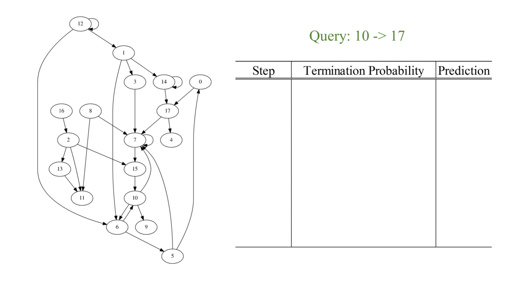

## Graph Reachability Dataset ##

### Description ###
We generate two synthetic datasets: a small graph dataset and a large graph dataset. In the small
graph dataset, it contains 500K small graphs, where each graph contains 9 nodes, and 16 direct edges
to randomly connect pairs of nodes. The large graph dataset contains 500K graphs, where each graph
contains 18 nodes, and 32 random direct edges. Duplicated edges are removed.
- Small graph
  - Training: graph.9.16.500000
  - Testing: graph.9.16.10000
  
- Large graph
  - Training: graph.18.32.500000
  - Testing: graph.18.32.10000

### Format ###

Passage \t Query \t Answer

Example (as shown in the graph above)
> 0 -> 17 # 1 -> 3 # 1 -> 14 # 1 -> 6 # 2 -> 11 # 2 -> 13 # 2 -> 15 # 3 -> 7 # 5 -> 0 # 5 -> 7 # 6 -> 10 # 6 -> 5 # 7 -> 15 # 7 -> 7 # 8 -> 11 # 8 -> 7 # 10 -> 9 # 10 -> 6 # 10 -> 7 # 12 -> 1 # 12 -> 12 # 12 -> 6 # 13 -> 11 # 14 -> 17 # 14 -> 14 # 15 -> 10 # 16 -> 2 # 17 -> 4 # 17 -> 7 # 	10 -> 17	1

### Reference ###

[ReasoNet: Learning to Stop Reading in Machine Comprehension][1], Yelong Shen, Po-Sen Huang, Jianfeng Gao, Weizhu Chen.
[1]: http://arxiv.org/abs/1609.05284

